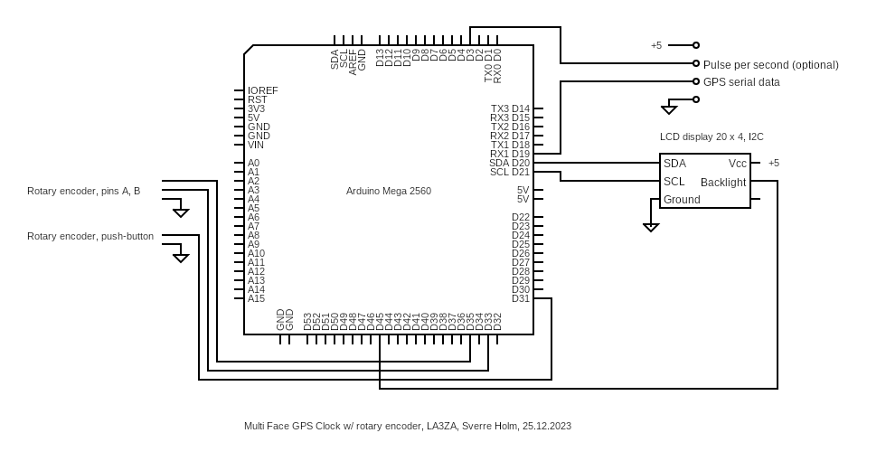
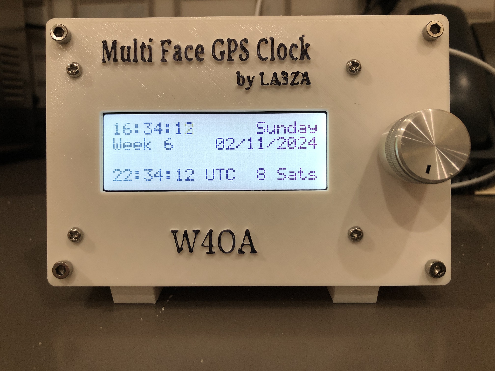
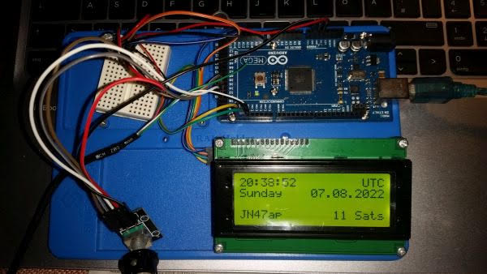

# Multi Face GPS Clock for the Arduino Mega

The purpose of this project is to make available as many clock and clock related functions as possible given the constraint of a 20 x 4 LCD. The number of different screens are now more than forty, see [Wiki](https://github.com/la3za/Multi-Face-GPS-Clock/wiki) for pictures of them all. Some are useful, some are very specialized, and some are there just because they can be made. All the screens have been laid out with a view to good esthetics and easy readability.

Please join the groups.io discussion group for the Multi Face GPS Clock and related projects: [https://groups.io/g/Multi-Face-GPS-Clock/]

The clock is inspired by the [Clock Kit from QRPLabs](https://qrp-labs.com/clockn.html). It is based on an Arduino Mega taking time and position data from a GPS, and the Arduino 2.2.1 IDE. It supports multiple languages in addition to English (default, and always used for UTC) for day names when local time is shown: Norwegian, German, French and Spanish, and optionally Icelandic, Danish, and Swedish. 

The new version 2 software makes setup much easier as most, if not all, parameters now can be entered via the rotary control, and there is minimal need for editing of the software.

Below the clock shows local time and UTC time. 

## YouTube videos
* Here's a YouTube video showing all the 24 screens in the Favorites subset of clock faces, using the Demo mode with 10 seconds per screen: https://youtu.be/AJEWBOJmE1E

* Here's a Youtube video showing how to set up the clock via the new menu system introduced in ver 2 of the software - all engaged by a short press on the rotary control. The clock starts with incorrect GPS baud rate so it won't read the GPS. That is changed and then it shows time in EU date format, Central European Daylight Saving time zone, Spanish local language. This is then changed to US date format, Eastern Daylight Time, and English as local language: https://www.youtube.com/watch?v=mNIamsUlenw

## Examples of clock faces:

Solar rise/set time. Line 2 Actual, Line 3 Civil, and Line 4 Nautical rise and set times:

Position data:

Lunar display with line 2 showing elevation and azimuth for the moon, Line 3 shows next time to set and at what azimuth, and Line 4 distance from earth in % of maximum and in km, and finally lunar phase, that the illumination is falling, and % illumination:

Binary, Octal, Decimal and Hex display of time:

Word clock:

Prediction of lunar eclipses:

Math calculation clock:

See [the project wiki](https://github.com/la3za/Multi-Face-GPS-Clock/wiki) for images of the various screens as well as screens showing the local language adaptations.

The LA3ZA blog has posts with documentation of hardware and the different screens showing solar and lunar position, their rise and set times, moon phase, date for Easter Sunday in Gregorian and Julian calendars and much more. See keyword ["Multi-face GPS clock"](https://la3za.blogspot.com/search/label/Multi-face%20GPS%20clock), starting with early development in 2016 up to the present. 

## Hardware schematic, supported from v2.0.0 and onwards:

The user interface for choosing clock face and for setup is the rotary encoder with push button. Use of the PPS (Pulse per second) output of the GPS for interrupt-driven timing of second pulse is optional from v2.1.0.

See [wiki](https://github.com/la3za/Multi-Face-GPS-Clock/wiki) for more details on hardware and software setup.

## Other users

Mitch, W4OA, made a nice 3D case for the clock. His design and his STL-files can be found in the [W4OA directory](https://github.com/la3za/Multi-Face-GPS-Clock/tree/master/Builds/W4OA):

Here is the breadboard of Michael, DK7UX, with GPS from QRPLabs QLG1 or QLG2. It shows how simple the hardware is:

Please get in touch if you want to display your implementation here!

